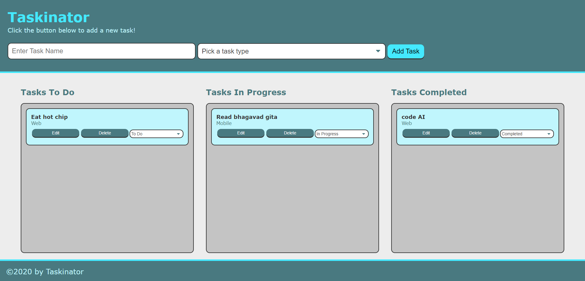

# Taskinator

  
## Description

A task-tracker app that allows you to organize your personal to-do list items by using a dropdown menu to change the task status and move the task into To Do, In Progress, and Completed lists.

## Table of Contents

- [Installation](#installation)
- [License](#license)
- [Contributing](#contributing)
- [Tests](#tests)
- [Questions](#questions)

## Installation

No installation required. Clone this repository to your local machine and open in your preferred web browser.

## License
    
Licensed under the [MIT License](https://spdx.org/licenses/MIT.html)

## Contributing

No contributions will be accepted at this time.

## Tests

No testing is planned for this project at this time.

## Questions

Have questions? Reach me at the following sources!

* GitHub: [realnifty](https://github.com/realnifty)
* E-mail: rogelioalbertopedraza@gmail.com or lovecore@pm.me